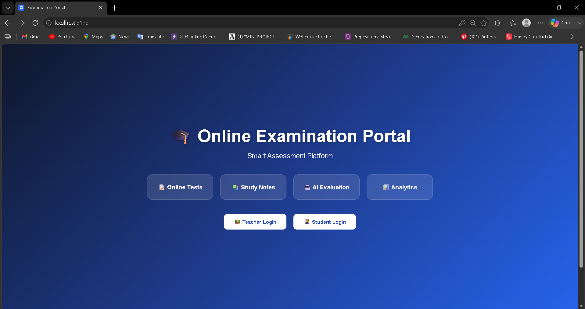
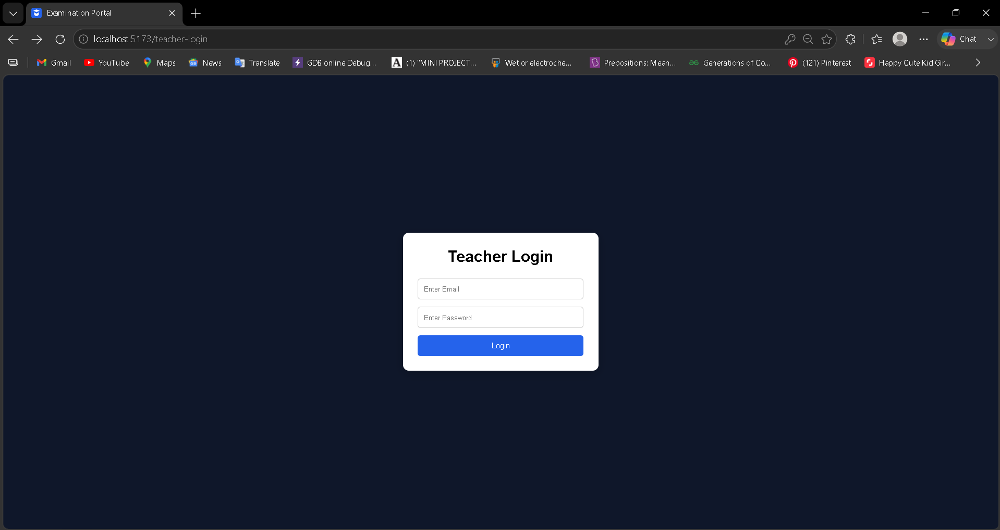
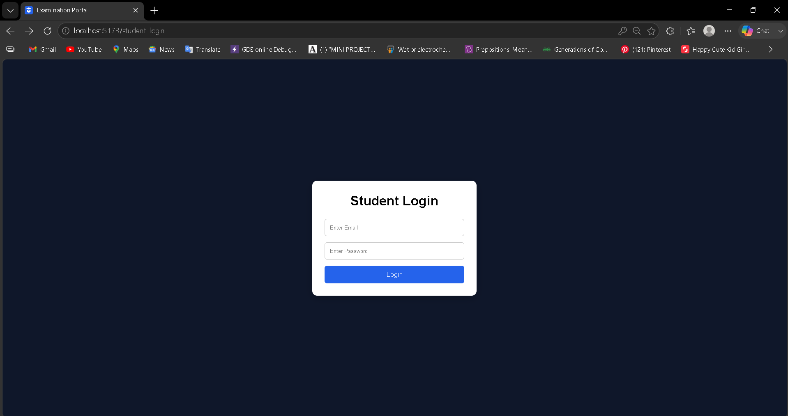
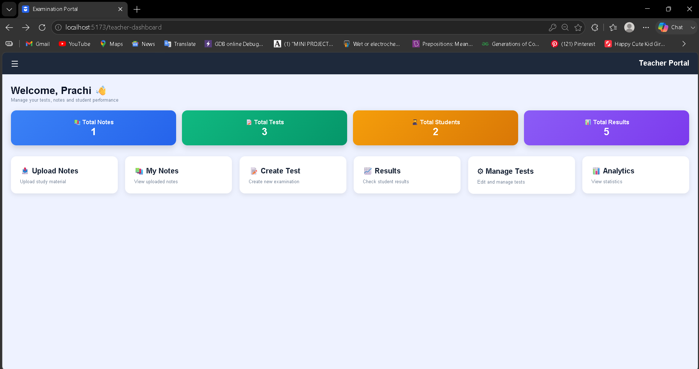
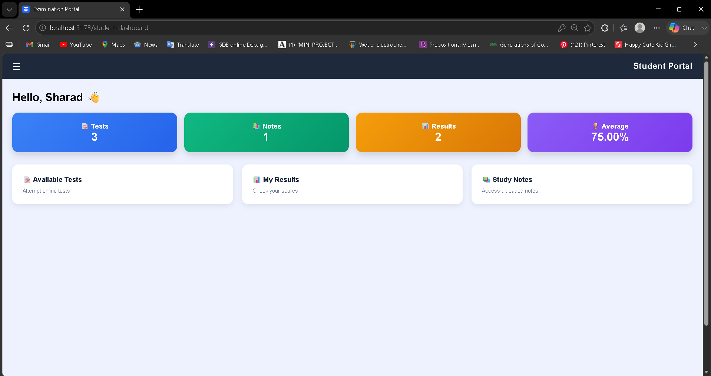

# 🎓 AI Powered Online Examination Portal

A full-stack web application that allows teachers to create and manage online examinations while enabling students to attempt tests, access study notes, and view results. The system also includes AI-based evaluation for subjective answers, analytics dashboards, result visualization, and performance tracking.

---

# 📌 Project Overview

The AI Powered Online Examination Portal is designed to digitize the examination process in educational institutions.

The system provides separate portals for Teachers and Students.

### Teacher Features

* Teacher Login
* Upload Study Notes
* View Uploaded Notes
* Create Tests
* Edit Tests
* Delete Tests
* View Test Details
* Generate Results
* AI Evaluation for Subjective Answers
* Student Performance Analytics
* Dashboard Statistics

### Student Features

* Student Login
* View Available Tests
* Attempt Online Tests
* Automatic Timer
* One-Time Test Submission
* View Results
* Pie Chart Performance Analysis
* View Study Notes

---

# 🛠 Technology Stack

| Technology       | Purpose                      |
| ---------------- | ---------------------------- |
| React.js         | Frontend                     |
| Vite             | Frontend Build Tool          |
| CSS3             | Styling                      |
| Node.js          | Backend Runtime              |
| Express.js       | Backend Framework            |
| MongoDB          | Database                     |
| Mongoose         | ODM                          |
| JWT              | Authentication               |
| bcryptjs         | Password Hashing             |
| Chart.js         | Analytics & Graphs           |
| Google Gemini AI | Subjective Answer Evaluation |

---

# 📂 Project Structure

```text
Online-Examination-Portal
│
├── frontend
│   ├── src
│   │   ├── api
│   │   ├── components
│   │   ├── layouts
│   │   ├── pages
│   │   │   ├── Teacher
│   │   │   └── Student
│   │   ├── styles
│   │   └── App.jsx
│
├── backend
│   ├── config
│   ├── controllers
│   ├── models
│   ├── routes
│   ├── utils
│   └── server.js
│
└── README.md
```

---

# ⚙️ Installation Guide

## 1. Clone Repository

```bash
git clone <repository-url>
```

---

## 2. Install Frontend Dependencies

```bash
cd frontend
npm install
```

---

## 3. Install Backend Dependencies

```bash
cd backend
npm install
```

---

# 🔐 Environment Variables

Create a `.env` file inside the backend folder.

### backend/.env

```env
PORT=5000

MONGO_URI=your_mongodb_connection_string

JWT_SECRET=your_secret_key

GEMINI_API_KEY=your_gemini_api_key
```

---

# ▶️ Running The Project

## Start Backend

```bash
cd backend
npm run server
```

---

## Start Frontend

```bash
cd frontend
npm run dev
```

---

Frontend:

```text
http://localhost:5173
```

Backend:

```text
http://localhost:5000
```

---

# 🗄 Database Models

## Teacher

```text
Name
Email
Password
```

---

## Student

```text
Name
Email
Password
Course
```

---

## Notes

```text
Title
Subject
Note Link
Uploaded By
```

---

## Test

```text
Test Name
Subject
Duration
Questions
Created By
```

---

## Student Response

```text
Student Name
Test ID
Answers
```

---

## Result

```text
Student Name
Test Name
Correct Answers
Incorrect Answers
Percentage
AI Score
AI Feedback
```

---

# 🔄 System Flow

## Teacher Flow

```text
Teacher Login
      │
      ▼
Teacher Dashboard
      │
 ┌──────┼──────┬────────┬─────────┐
 ▼      ▼      ▼        ▼         ▼

Notes Tests Results Analytics My Notes
```

---

## Student Flow

```text
Student Login
      │
      ▼
Student Dashboard
      │
 ┌──────┼──────┬
 ▼      ▼      ▼

Tests Notes Results
```

---

# 📊 Result Generation Flowchart

```text
Student Attempts Test
          │
          ▼
Answers Saved
          │
          ▼
Teacher Clicks Generate Results
          │
          ▼
System Checks Answers
          │
          ▼
Calculate Percentage
          │
          ▼
Evaluate Subjective Answers Using AI
          │
          ▼
Store Result In Database
          │
          ▼
Display Result Dashboard
```

---

# 🤖 AI Evaluation Flowchart

```text
Subjective Answer
        │
        ▼
Send To Gemini AI
        │
        ▼
Evaluate Quality
        │
        ▼
Generate Score
        │
        ▼
Generate Feedback
        │
        ▼
Save Into Result Collection
```

---

# 📈 Analytics Features

* Total Notes
* Total Tests
* Total Students
* Total Results
* Average Score
* Highest Score

---

# 🔒 Security Features

* Password Hashing using bcryptjs
* JWT Authentication
* Protected Routes
* One-Time Test Submission
* Unauthorized Access Prevention

---

# 🎯 Special Features

### AI Based Evaluation

The system evaluates subjective answers using Google Gemini AI and provides:

* AI Score
* AI Feedback
* Performance Suggestions

---

### One Time Submission

Students can attempt a test only once.

After submission:

```text
Already Submitted
```

status is displayed.

---

### Result Visualization

Student and Teacher dashboards include:

* Pie Charts
* Percentage Analysis
* Correct vs Incorrect Answers
* AI Evaluation Report

---

# 📷 Screenshots To Include

Add screenshots inside:

```text
README Screenshots/
```

Recommended screenshots:

### Home Page



### Teacher Login



### Student Login



### Teacher Dashboard




### Student Dashboard



---

# 🚀 Future Enhancements

* Certificate Generation
* Email Notifications
* Test Scheduling
* Leaderboard System
* Question Bank
* PDF Notes Upload
* Dark Mode
* Mobile Application

---

# 👩‍💻 Developed By

Prachi Agrawal

B.Tech Computer Science Engineering

---

# 📄 License

This project is developed for educational and academic purposes.
